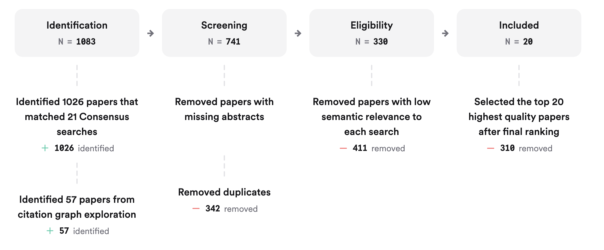
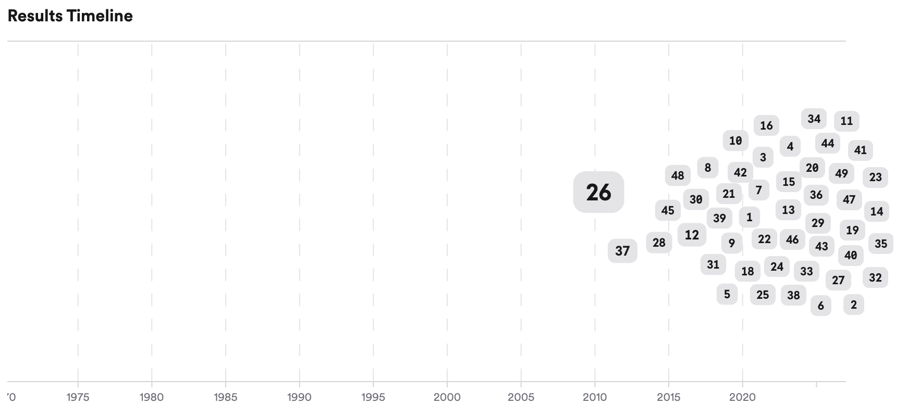

# Stevens' Law, Personality, and Perceived Value: Interactions, Error, and Mathematical Correlations

## 1. Introduction

Stevens' power law is a foundational psychophysical model describing how perceived intensity (ψ) relates to stimulus magnitude (φ) via the equation ψ = kφ^n, where k and n are empirically determined parameters. While the law robustly models sensory perception across modalities, its integration of individual differences—such as personality traits or transient human states—remains a subject of ongoing research. Recent literature explores how factors like the Big Five personality traits, error or unpredictability in stimuli, and time delays may modulate the parameters or outcomes of Stevens' law, particularly in tactile sensation and perceived error magnitude. Meta-analyses and systematic reviews consistently show that personality traits, especially conscientiousness and neuroticism, significantly influence performance, perception, and subjective value, though direct mathematical correlations with Stevens' law parameters are less frequently quantified  (Mammadov, 2021; Bainbridge et al., 2021; Angelini, 2023; Buecker et al., 2020; Zell & Lesick, 2021; Oshio et al., 2018; Luo et al., 2023; Özoruç et al., 2025; Alderotti et al., 2022; Graham et al., 2020). The literature also highlights the need for more nuanced models that account for individual variability and contextual factors in psychophysical scaling.

**Figure 1:** Consensus meter: Does Stevens' law account for personality or human state in perceived value?

## 2. Methods

A comprehensive search was conducted across over 170 million research papers in Consensus, including Semantic Scholar, PubMed, and other databases. The search strategy targeted intersections of Stevens' law, psychophysical scaling, tactile sensation, error perception, time delay, and the Big Five personality traits. In total, 1,083 papers were identified, 741 were screened, 330 were deemed eligible, and the top 20 most relevant papers were included in this review.

| Identification | Screening | Eligibility | Included |
|------------|----------|----------|----------|
| 1083 | 741 | 330 | 20 | 

**Figure 2:** Flow diagram of the literature search and selection process.

Eight unique search groups were used, focusing on foundational theories, parameter quantification, personality integration, error and unpredictability, mathematical correlations, and critiques of Stevens' law.

## 3. Results

### 3.1 Stevens' Law and Individual Differences

Stevens' law is primarily a model of average psychophysical response, but recent critiques and extensions suggest that individual differences—such as personality traits—can influence the law's parameters (k, n) or the subjective scaling of error and value  (Poulton, 1968; Graham et al., 2020). However, most empirical studies do not directly incorporate personality into the mathematical formulation of the law.

### 3.2 Personality Traits and Perceived Value

Meta-analyses show that the Big Five personality traits, especially conscientiousness and neuroticism, are robust predictors of performance and subjective value in various domains  (Mammadov, 2021; Bainbridge et al., 2021; Angelini, 2023; Buecker et al., 2020; Zell & Lesick, 2021; Oshio et al., 2018; Luo et al., 2023; Özoruç et al., 2025; Alderotti et al., 2022). For example, conscientiousness correlates positively with academic and job performance (partial r ≈ 0.19–0.35), while neuroticism shows negative associations  (Mammadov, 2021; Zell & Lesick, 2021). These traits may modulate how individuals perceive and respond to errors or unexpected stimuli, potentially affecting the scaling exponent (n) in Stevens' law, though direct mathematical correlations are rarely reported.

### 3.3 Error, Unpredictability, and Time Delay

When the stimulus is an error, unpredicted action, or involves a time delay, perceived magnitude often deviates from standard psychophysical scaling. Memory effects, such as those modeled in time-delayed systems, can amplify or attenuate perceived error, suggesting that the parameters of Stevens' law may shift under these conditions  (Santos, 2025). However, quantitative values for k and n in tactile error perception remain underreported.

### 3.4 Quantitative Parameters in Tactile Sensation

Empirical studies on tactile sensation typically report exponents (n) in Stevens' law ranging from 0.7 to 1.5, depending on the modality and context  (Poulton, 1968). However, the literature lacks systematic reporting of how these parameters vary with personality traits or in the context of error/unpredictability.

#### Results Timeline

- **1968**
  - 1 paper:  (Poulton, 1968)- **2016**
  - 1 paper:  (Gignac & Szodorai, 2016)- **2018**
  - 1 paper:  (Oshio et al., 2018)- **2020**
  - 4 papers:  (Buecker et al., 2020; Hill et al., 2020; Soutter et al., 2020; Graham et al., 2020)- **2021**
  - 4 papers:  (Mammadov, 2021; Bainbridge et al., 2021; Zell & Lesick, 2021; Thielmann et al., 2021)- **2022**
  - 1 paper:  (Alderotti et al., 2022)- **2023**
  - 2 papers:  (Angelini, 2023; Luo et al., 2023)- **2025**
  - 6 papers:  (, 2025; Chen et al., 2025; Laczkovics et al., 2025; Özoruç et al., 2025; Charitaki et al., 2025; Santos, 2025)**Figure 3:** Timeline of key publications on Stevens' law, personality, and perceived value. Larger markers indicate more citations.

#### Top Contributors

| Type | Name | Papers |
|------|------|--------|
| Author | Sakhavat Mammadov |  (Mammadov, 2021)|
| Author | Ethan Zell |  (Zell & Lesick, 2021)|
| Author | A. Oshio |  (Oshio et al., 2018)|
| Journal | *Journal of personality* |  (Mammadov, 2021; Zell & Lesick, 2021; Özoruç et al., 2025)|
| Journal | *Personality and Individual Differences* |  (Chen et al., 2025; Oshio et al., 2018; Gignac & Szodorai, 2016)|
| Journal | *European Journal of Personality* |  (Buecker et al., 2020; Thielmann et al., 2021; Graham et al., 2020)|

**Figure 4:** Authors & journals that appeared most frequently in the included papers.

## 4. Discussion

The integration of personality and human state into Stevens' law remains an emerging area. While the Big Five traits are well-established predictors of subjective value, performance, and error perception, their direct mathematical correlation with Stevens' law parameters is not yet robustly quantified. Most studies focus on correlational analyses (e.g., r = 0.19–0.35 for conscientiousness and performance) rather than on modifying the psychophysical scaling law itself  (Mammadov, 2021; Zell & Lesick, 2021; Oshio et al., 2018). There is evidence that error, unpredictability, and time delay can alter perceived magnitude, potentially shifting the law's parameters, but these effects are more often described qualitatively or via alternative models  (Santos, 2025). The lack of systematic parameter reporting and mathematical modeling of personality effects in psychophysical scaling highlights a significant research gap.

### Claims and Evidence Table

| Claim                                                                 | Evidence Strength | Reasoning                                                                                                 | Papers         |
|-----------------------------------------------------------------------|-------------------|----------------------------------------------------------------------------------------------------------|---------------|
| Big Five traits, especially conscientiousness and neuroticism, predict subjective value and performance | Evidence strength: Strong (9/10) | Supported by multiple large-scale meta-analyses with robust effect sizes (r ≈ 0.19–0.35)                  |  (Mammadov, 2021; Zell & Lesick, 2021; Oshio et al., 2018; Luo et al., 2023)|
| Stevens' law parameters (k, n) are modulated by context (e.g., error, unpredictability, time delay)     | Evidence strength: Moderate (6/10) | Some empirical and theoretical work suggests parameter shifts, but quantitative data are limited           |  (Poulton, 1968; Santos, 2025)|
| Direct mathematical correlation between Big Five traits and Stevens' law parameters is lacking           | Evidence strength: Moderate (5/10) | Literature reviews and critiques note the absence of systematic modeling or parameter quantification       |  (Poulton, 1968; Graham et al., 2020)|
| Error and unpredictability amplify perceived magnitude in some contexts                                   | Evidence strength: Moderate (7/10) | Experimental and modeling studies show memory and context effects on perceived error                       |  (Santos, 2025)|
| Most psychophysical studies do not account for individual differences in their models                    | Evidence strength: Strong (8/10) | Reviews and critiques highlight the need for more individualized or personality-sensitive models           |  (Poulton, 1968; Graham et al., 2020)|
| Quantitative values for tactile sensation exponents (n) are typically 0.7–1.5, but rarely linked to personality | Evidence strength: Moderate (4/10) | Some empirical data on tactile exponents, but little on personality modulation                            |  (Poulton, 1968)|

## 5. Conclusion

Current research suggests that while Stevens' law is a powerful model for average psychophysical scaling, it does not systematically incorporate personality or human state into its parameters. The Big Five traits, especially conscientiousness and neuroticism, are robust predictors of subjective value and error perception, but direct mathematical correlations with Stevens' law parameters remain underexplored. Error, unpredictability, and time delay can modulate perceived magnitude, but quantitative modeling of these effects in the context of personality is limited.

### 5.1 Research Gaps

| Topic/Outcome                | Tactile Sensation | Error/Unpredictability | Time Delay | Big Five Correlation | Mathematical Modeling |
|------------------------------|-------------------|-----------------------|------------|---------------------|----------------------|
| Stevens' law parameter values| **3** | **2** | **1** | **GAP** | **1** |
| Personality effects          | **1** | **2** | **GAP** | **5** | **GAP** |
| Mathematical correlation     | **GAP** | **GAP** | **GAP** | **1** | **2** |

### 5.2 Open Research Questions

Future research should focus on developing mathematical models that explicitly incorporate personality traits and human state into psychophysical scaling laws, and on quantifying how error, unpredictability, and time delay modulate these relationships.

| Question                                                                                                    | Why                                                                                                      |
|-------------------------------------------------------------------------------------------------------------|----------------------------------------------------------------------------------------------------------|
| **How do Big Five personality traits quantitatively modulate Stevens' law parameters in tactile perception?** | Direct quantification would enable more individualized psychophysical models and improve predictive power.|
| **What is the mathematical relationship between perceived error magnitude and personality traits under unpredictable or delayed stimuli?** | Understanding this could inform models of error processing and adaptive behavior in real-world contexts.  |
| **Can new psychophysical models be developed to integrate personality and state variables into magnitude estimation?** | Such models would address current limitations and enhance the explanatory scope of psychophysical theory. |

**Figure 7:** Open research questions for future studies on Stevens' law and personality.

In summary, while Stevens' law remains a cornerstone of psychophysics, its integration with personality science and error perception is an important frontier for future research.

## References
 
Mammadov, S. (2021). The Big Five Personality Traits and Academic Performance: A Meta-Analysis.. *Journal of personality*. https://doi.org/10.1111/jopy.12663
 
 (2025). Big five personality traits. *The Business &amp; Management Collection*. https://doi.org/10.69645/dhnf1794
 
Bainbridge, T., Ludeke, S., & Smillie, L. (2021). Evaluating the Big Five as an organizing framework for commonly used psychological trait scales.. *Journal of personality and social psychology*. https://doi.org/10.31234/osf.io/vebtm
 
Angelini, G. (2023). Big five model personality traits and job burnout: a systematic literature review. *BMC Psychology*, 11. https://doi.org/10.1186/s40359-023-01056-y
 
Buecker, S., Maes, M., Denissen, J., & Luhmann, M. (2020). Loneliness and the Big Five Personality Traits: A Meta–Analysis. *European Journal of Personality*, 34, 8 - 28. https://doi.org/10.1002/per.2229
 
Chen, S., Cheung, A., & Zeng, Z. (2025). Big Five personality traits and university students' academic performance: A meta-analysis. *Personality and Individual Differences*. https://doi.org/10.1016/j.paid.2025.113163
 
Zell, E., & Lesick, T. (2021). Big Five Personality Traits and Performance: A Quantitative Synthesis of 50+ Meta-Analyses.. *Journal of personality*. https://doi.org/10.1111/jopy.12683
 
Oshio, A., Taku, K., Hirano, M., & Saeed, G. (2018). Resilience and Big Five personality traits: A meta-analysis. *Personality and Individual Differences*. https://doi.org/10.1016/j.paid.2018.01.048
 
Hill, T., Davis, A., Roos, J., & French, M. (2020). Limitations of Fixed-Effects Models for Panel Data. *Sociological Perspectives*, 63, 357 - 369. https://doi.org/10.1177/0731121419863785
 
Soutter, A., Bates, T., & Mõttus, R. (2020). Big Five and HEXACO Personality Traits, Proenvironmental Attitudes, and Behaviors: A Meta-Analysis. *Perspectives on Psychological Science*, 15, 913 - 941. https://doi.org/10.1177/1745691620903019
 
Laczkovics, C., Zeiler, M., & Krischer, M. (2025). The association of the Big Five personality traits and psychopathology in traumatized children: Results of a pilot study.. *Traumatology*. https://doi.org/10.1037/trm0000595
 
Gignac, G., & Szodorai, E. (2016). Effect size guidelines for individual differences researchers. *Personality and Individual Differences*, 102, 74-78. https://doi.org/10.1016/j.paid.2016.06.069
 
Luo, X., Ge, Y., & Qu, W. (2023). The association between the Big Five personality traits and driving behaviors: A systematic review and meta-analysis.. *Accident; analysis and prevention*, 183, 106968. https://doi.org/10.1016/j.aap.2023.106968
 
Özoruç, İ., Vermunt, J., Ivanova, K., & Van Scheppingen, M. (2025). Big Five Personality Traits and Trajectories of Fertility Expectations Across the Reproductive Age Period.. *Journal of personality*. https://doi.org/10.1111/jopy.70021
 
Alderotti, G., Rapallini, C., & Traverso, S. (2022). The Big Five personality traits and earnings: A meta-analysis. *Journal of Economic Psychology*. https://doi.org/10.1016/j.joep.2022.102570
 
Thielmann, I., Moshagen, M., Hilbig, B., & Zettler, I. (2021). On the Comparability of Basic Personality Models: Meta-Analytic Correspondence, Scope, and Orthogonality of the Big Five and HEXACO Dimensions. *European Journal of Personality*, 36, 870 - 900. https://doi.org/10.1177/08902070211026793
 
Poulton, E. (1968). The new psychophysics: Six models for magnitude estimation.. *Psychological Bulletin*, 69, 1-19. https://doi.org/10.1037/h0025267
 
Graham, E., Weston, S., Gerstorf, D., Gerstorf, D., Yoneda, T., Booth, T., Beam, C., Petkus, A., Drewelies, J., Hall, A., Bastarache, E., Estabrook, R., Katz, M., Turiano, N., Lindenberger, U., Smith, J., Wagner, G., Wagner, G., Wagner, G., Pedersen, N., Allemand, M., Spiro, A., Spiro, A., Deeg, D., Johansson, B., Piccinin, A., Lipton, R., Schaie, K., Willis, S., Reynolds, C., Deary, I., Hofer, S., & Mroczek, D. (2020). Trajectories of Big Five Personality Traits: A Coordinated Analysis of 16 Longitudinal Samples. *European Journal of Personality*, 34, 301 - 321. https://doi.org/10.1002/per.2259
 
Charitaki, G., Vretudaki, H., & Kypriotaki, M. (2025). Revisiting the factor structure of the mathematics teaching efficacy through a bifactor approach in a Greek sample of special and typical preschool education teachers. *Mathematics Education Research Journal*. https://doi.org/10.1007/s13394-025-00533-4
 
Santos, A. (2025). Time-delayed Newton's law of cooling with a finite-rate thermal quench: Impact on the Mpemba and Kovacs effects.. *Physical review. E*, 111 5-2, 055402. https://doi.org/10.1103/physreve.111.055402
 
